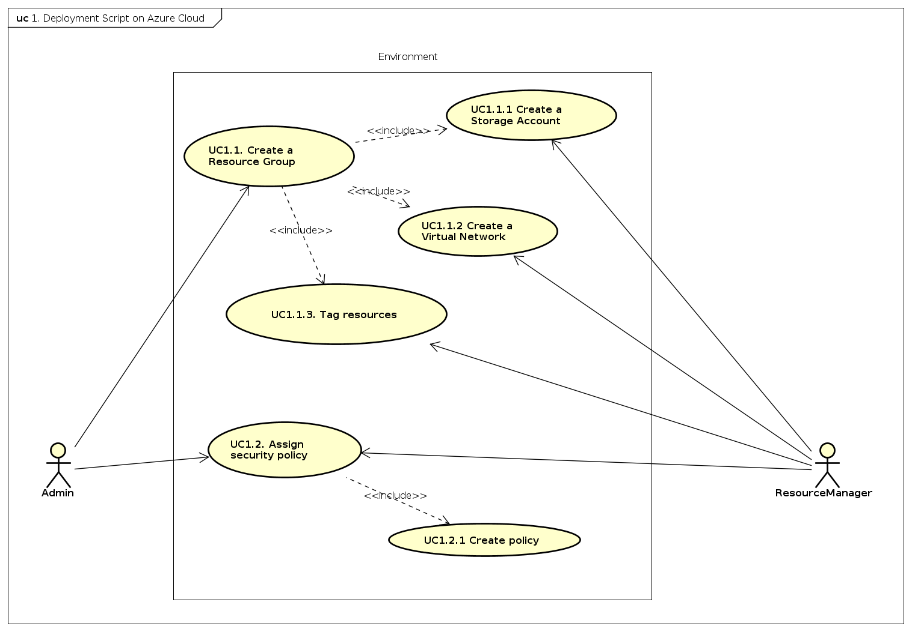

# Initial situation

In this page, I will use the first person. In this way, I hope, to give a better
idea of how I proceeded to solve this assessment, what problems I encountered
on the road and how I worked.

## From where I started

At the beginning of the assessment I started with no specific knowledge on
Azure Resource Manager. Before, I worked on AWS mostly and was little familiar
with AWS CloudFormation tool.

First of all, before starting to work on the assessment I made a little plan
of the moments to use as time slots dedicated to this assessment.

From the beginning, I planned to work and learn in an active fashion. By this,
I mean to alternate studying moments with practical sessions. During the practical
sessions I implemented different demonstrations around the topics involved
within the assessment.

I started from the following UML use case diagram: 

Here, I show the `top down` approach during my studying moments, let's call it
also as analysis phase. During this moment in time, integrating practical and
implementation sessions helped me to understand better the context and the
problem space.

Furthermore, for the implementation of the deployment script I followed the
`bottom-up` approach. I solved little and self-consistent external problems firstly.
Secondly, I integrated them one-by-one.

Here, I was used to involve the `AZ CLI` tool. The motivation for this is because
it does not require deep knowledge about PowerShell, REST API, Autentication and so on.
For this purpose and to automate the repetite commands I configured ad hoc a
Makefile file. Its content I attache here for completeness:

```bash

# It's necessary to set this because some environments don't link sh -> bash.
SHELL := /bin/bash

# Variables

RESOURCE_GROUP 		= ${ARG}
SUBSCRIPTION_ID 	= ${ASID}
CLOUD_REGION 		= ${ACR}
POLICY_RULES_URI	= ${PRU}
POLICY_PARAMS_URI	= ${PPU}

all: a-resource-group \
	 a-tag-on-resource-group \
	 a-main-deployment

a-resource-group:
		az group create \
				--name ${RESOURCE_GROUP} \
				--subscription ${SUBSCRIPTION_ID}  \
				--location ${CLOUD_REGION}

a-tag-on-resource-group:
		az group update \
				--name ${RESOURCE_GROUP} \
				--set tags.Environment=Test tags.Company=Sentia

a-resource-group-deletion:
		az group delete \
				--name ${RESOURCE_GROUP}

a-list-of-resource-groups:
		az group list

a-network-template-validation:
		az group deployment validate \
			--resource-group ${RESOURCE_GROUP} \
			--template-file ./templates/VirtualNetwork.template.json

an-sa-template-validation:
	    az group deployment validate \
		    --resource-group ${RESOURCE_GROUP} \
			--template-file ./templates/StorageAccount.template.json

a-main-template-validation:
		az group deployment validate \
		   --subscription ${SUBSCRIPTION_ID} \
		   --resource-group ${RESOURCE_GROUP} \
		   --template-file ./main.template.json \
		   --parameters @main.parameters.json 

a-main-deployment:
		az group deployment create \
			--subscription ${SUBSCRIPTION_ID} \
			--resource-group ${RESOURCE_GROUP} \
			--template-file ./main.template.json \
			--parameters @main.parameters.json \
			--debug --verbose

a-policy-definition:
		az policy definition create \
			--name 'allowed-resource-types' \
			--display-name 'Allowed Group' \
			--description 'This policy enables you to specify the resource types that your developers can deploy' \
			--rules ${POLICY_RULES_URI} \
			--mode All

a-policy-assignment:
		az policy assignment create \
                --name 'allow-resourcetypes-assignment' \
                --display-name 'An assignment to Allow Resource Types in a given ResourceGroup' \
				--policy 'allowed-resource-types' \
				-g ${RESOURCE_GROUP}

a-provider-policy-insights-registration:
		az provider register --namespace 'Microsoft.PolicyInsights'

```

As it is possible to see, there are different Makefile rules for different parts.
Some of them relate to networking, storage and policy definition template file.

To respect the non functional requirements, attached [here](../../README.md),
I followed the `nesting` approach through WEB URIs to compose the main template.

Once the templates where at a good level of completeness, I started to work on
the PolicyDefinition. Here, I had to uderstand the concepts and diferent relations
between policies and Azure's resources.

In the first moment of my work on policies, I tried to use the `BuiltIn` policies
of Azure Cloud Provider. But there was no way to pass only the top level of the
Network,Storage and Compute types to the `BuiltIn` policy. I opted, here, to implement
a `Custom` policy definition to allow `Microsoft.Storage/*, Microsoft.Network/*, Microsoft.Compute/*` resourcetypes. For completeness, this is the PolicyDefinition JSON:

```bash

{
        "if": {
          "not": {
            "anyOf": [
            {
              "field": "type",
              "like": "Microsoft.Compute/*"
            },
            {
              "field": "type",
              "like": "Microsoft.Network/*"
            },
            {
              "field": "type",
              "like": "Microsoft.Storage/*"
            }
            ]}
      },
       "then": {
         "effect": "deny"
       }
}


```

Having defined the rule for the Policy, I continued to implement the assignment.
In the first place I used the Azure CLI. For reference, the Makefile shows the
appropriate rules.

## Putting everything together

Thinking about the environment in which the deployment script will run is very
challenging. From one point of view, it depends from the end user, who will use it;
from other point of view it depends about the operational enviroment, where it is installed
and how it is configured.

Because of this, I choose to use PowerShell and all activities are done from
a perimeter that is external to the Azure infrastructure.

To this purpose the script is the following, *DeploymentScript.ps1*. You can find it [here](../../scripts/DeploymentScript.ps1).

The script assumes the following way of parameters configuration:

- One subset of environment variables; this way is used for sensitive data configuration.

- One subset as script arguments; this way is used for passiming specific configuration
  about the information used inside the script. By default, the script configures almost 
  all parameters. The only parameters that must configured and are mandatory are:

	- *$resourceGroupName*: the name of the Resource Group to be created.

	- *$resourceGroupLocation*: the location where all of the resources will be deployed.

	- *$deploymentName*: the name of the deployment.

*Note:* the script deals with some limitations regarding the *StorageAccount*.
To clarify this: the *StorageAccountName* is given by the following expression
*concat(parameters('StorageAccountPrefixName'), uniqueString(resourceGroup().id, deployment().name))*.
The StorageAccount is unique at deployment and resourceGroup level.

The tags are set at ResourceGroup level; then propagate by referencing them from
the linked templates of the main resource group.

Furthermore, the script is implemented using the procedural programming approach.

To get more information about the deployment commands, have a look [here](./20-deployment-guide.md).